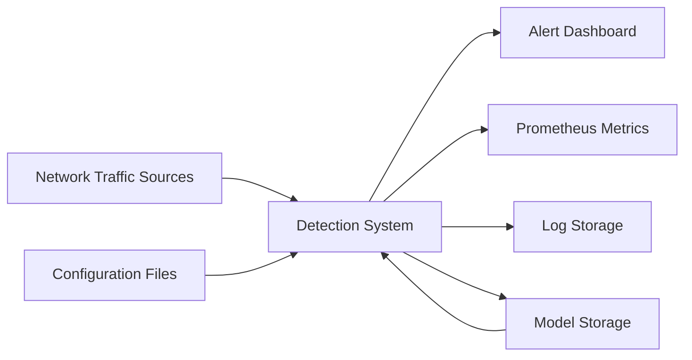
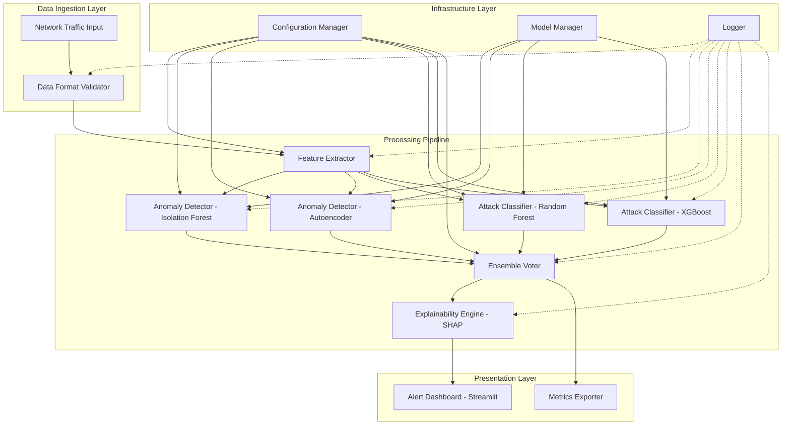

# Design Document: Zero-Day Network Attack Detection System

## Overview

The Zero-Day Network Attack Detection System is an AI-powered intrusion detection system that identifies previously unknown network attacks through ensemble machine learning. The system processes network traffic through a multi-stage pipeline combining anomaly detection (Isolation Forest and Autoencoder) with attack classification (Random Forest and XGBoost), using ensemble voting for final decisions and SHAP for explainability.

### Key Design Principles

1. **Modularity**: Each detection component (feature extraction, anomaly detection, classification, ensemble voting, explainability) operates independently with well-defined interfaces
2. **Ensemble Approach**: Multiple complementary ML models work together to improve detection accuracy and reduce false positives
3. **Real-time Processing**: Pipeline architecture supports streaming data with sub-2-second end-to-end latency
4. **Explainability-First**: SHAP integration provides interpretable explanations for every detection decision
5. **Fault Tolerance**: Degraded mode operation continues when individual models fail to load

### Architecture Style

The system follows a **pipeline architecture** pattern where data flows sequentially through transformation stages. This pattern is appropriate because:
- Each stage performs a distinct transformation (feature extraction → anomaly detection → classification → voting → explanation)
- Stages can be developed and tested independently
- The linear flow matches the natural progression from raw traffic to final alert
- Performance can be optimized at each stage independently

Research on hybrid anomaly detection frameworks ([EcoDefender architecture](https://arxiv.org/abs/2511.18235)) demonstrates that combining Autoencoder-based representation learning with Isolation Forest anomaly scoring achieves high detection accuracy (up to 94%) with low latency (27ms inference) in resource-constrained environments, validating our ensemble approach.

## Architecture

### System Context



### Component Architecture



### Pipeline Flow

The system processes traffic through these stages:

1. **Input Stage**: Network traffic arrives in CSV, JSON, or Pandas DataFrame format
2. **Validation Stage**: Schema and data type validation against required fields
3. **Feature Extraction Stage**: Raw traffic → normalized feature vectors (6 elements)
4. **Anomaly Detection Stage**: Parallel scoring by Isolation Forest and Autoencoder
5. **Classification Stage**: Parallel classification by Random Forest and XGBoost
6. **Ensemble Stage**: Weighted voting combines all model predictions
7. **Explanation Stage**: SHAP analysis generates feature importance for detections
8. **Presentation Stage**: Real-time dashboard displays alerts with explanations

### Concurrency Model

- **Parallel Model Execution**: Isolation Forest, Autoencoder, Random Forest, and XGBoost run concurrently on each sample using thread pool (ThreadPoolExecutor with 4 workers)
- **Batch Processing**: Incoming samples are batched in groups of 100 for efficient processing
- **Queue Management**: Producer-consumer pattern with bounded queue (max 1000 samples) prevents memory overflow under high load
- **Rate Limiting**: When queue reaches 80% capacity, backpressure signals upstream to slow ingestion

## Components and Interfaces

### 1. Feature Extractor

**Purpose**: Transform raw network traffic into normalized feature vectors suitable for ML models.

**Interface**:
```python
class FeatureExtractor:
    def extract_features(self, traffic_data: TrafficSample) -> FeatureVector:
        """
        Extract and normalize features from network traffic.
        
        Args:
            traffic_data: Raw network traffic with fields {timestamp, packet_size, 
                         byte_count, duration_seconds, protocol_type, flag_status, 
                         service_type}
        
        Returns:
            FeatureVector: Normalized array [num1, num2, num3, cat1, cat2, cat3]
                          where num1-3 are in range [0, 1] and cat1-3 are encoded
        
        Raises:
            ValidationError: If required fields are missing or invalid types
        """
```

**Implementation Details**:
- **Numerical Feature Scaling**: Min-max normalization using pre-computed training set min/max values stored in config
- **Categorical Encoding**: One-hot encoding for protocol_type, flag_status, service_type (vocabularies from training data)
- **Null Handling**: Default values applied before normalization (0 for numerical, "unknown" for categorical)
- **Validation**: Pydantic models enforce schema before processing

**Dependencies**:
- Configuration Manager (for normalization parameters)
- Logger (for validation errors)

### 2. Anomaly Detector - Isolation Forest

**Purpose**: Detect anomalies using tree-based isolation of outliers.

**Interface**:
```python
class IsolationForestDetector:
    def __init__(self, model_path: str, contamination: float):
        """Initialize with trained model and contamination parameter."""
    
    def score_anomaly(self, feature_vector: FeatureVector) -> AnomalyScore:
        """
        Compute anomaly score using Isolation Forest.
        
        Args:
            feature_vector: Normalized 6-element array
        
        Returns:
            AnomalyScore: Value in range [-1.0, 1.0] where < -0.5 indicates anomaly
        
        Raises:
            ModelError: If model not loaded or dimension mismatch
        """
```

**Implementation Details**:
- **Model**: Scikit-learn IsolationForest with 100 estimators
- **Scoring**: Uses `decision_function()` which returns scores in [-1, 1] range
- **Threshold**: Configurable contamination parameter (default 0.1)
- **Performance**: Target 95th percentile latency < 100ms (achieved through compiled model)

### 3. Anomaly Detector - Autoencoder

**Purpose**: Detect anomalies through reconstruction error analysis.

**Interface**:
```python
class AutoencoderDetector:
    def __init__(self, model_path: str, max_error: float):
        """Initialize with trained autoencoder and max reconstruction error."""
    
    def score_anomaly(self, feature_vector: FeatureVector) -> AnomalyScore:
        """
        Compute anomaly score using reconstruction error.
        
        Args:
            feature_vector: Normalized 6-element array
        
        Returns:
            AnomalyScore: Value in range [0.0, 1.0] normalized by max_error
        
        Raises:
            ModelError: If model not loaded or dimension mismatch
        """
```

**Implementation Details**:
- **Architecture**: 3-layer autoencoder (6 → 4 → 2 → 4 → 6) using TensorFlow/Keras
- **Activation**: ReLU for hidden layers, linear for output
- **Loss Function**: Mean Squared Error between input and reconstruction
- **Normalization**: Reconstruction errors normalized by `max_error` from training set (99th percentile of training reconstruction errors)
- **Model Format**: Saved as HDF5 (.h5) file

### 4. Attack Classifier - Random Forest

**Purpose**: Classify detected anomalies into attack types.

**Interface**:
```python
class RandomForestClassifier:
    def __init__(self, model_path: str, n_estimators: int = 100):
        """Initialize with trained Random Forest model."""
    
    def classify(self, feature_vector: FeatureVector) -> ClassificationResult:
        """
        Classify attack type using Random Forest.
        
        Args:
            feature_vector: Normalized 6-element array
        
        Returns:
            ClassificationResult: {
                "class": str,  # One of {DoS, Probe, R2L, U2R, Normal}
                "confidence": float  # Range [0.00, 1.00] with 2 decimals
            }
        
        Raises:
            ModelError: If model not loaded or dimension mismatch
            TimeoutError: If classification exceeds 50ms timeout
        """
```

**Implementation Details**:
- **Model**: Scikit-learn RandomForestClassifier with 100 trees
- **Prediction**: Uses `predict_proba()` for confidence scores
- **Timeout**: Wrapped in timeout decorator (50ms)
- **Performance**: Target 95th percentile latency < 50ms

### 5. Attack Classifier - XGBoost

**Purpose**: Provide gradient boosting-based attack classification.

**Interface**:
```python
class XGBoostClassifier:
    def __init__(self, model_path: str):
        """Initialize with trained XGBoost model."""
    
    def classify(self, feature_vector: FeatureVector) -> ClassificationResult:
        """
        Classify attack type using XGBoost.
        
        Args:
            feature_vector: Normalized 6-element array
        
        Returns:
            ClassificationResult: {
                "class": str,  # One of {DoS, Probe, R2L, U2R, Normal}
                "confidence": float  # Range [0.0, 1.0]
            }
        
        Raises:
            ModelError: If model not loaded or dimension mismatch
        """
```

**Implementation Details**:
- **Model**: XGBoost classifier with early stopping
- **Fallback**: Falls back to Random Forest if XGBoost unavailable
- **Prediction**: Uses `predict_proba()` for confidence scores
- **Model Format**: Saved as JSON (.json) file using XGBoost's native format

### 6. Ensemble Voter

**Purpose**: Combine predictions from multiple models through weighted voting.

**Interface**:
```python
class EnsembleVoter:
    def __init__(self, model_weights: Dict[str, float]):
        """
        Initialize with model weights.
        
        Args:
            model_weights: Dictionary mapping model names to weights [0.0, 1.0]
                          Weights are normalized to sum to 1.0
        """
    
    def vote(self, predictions: List[ModelPrediction]) -> FinalDecision:
        """
        Combine model predictions through weighted voting.
        
        Args:
            predictions: List of predictions from available models (min 2)
        
        Returns:
            FinalDecision: {
                "decision": str,  # "Attack" or "Normal"
                "confidence": float,  # Range [0.0, 1.0]
                "contributing_models": List[str]  # Models that voted
            }
        
        Raises:
            InsufficientPredictionsError: If fewer than 2 predictions available
        """
```

**Implementation Details**:
- **Voting Strategy**: Weighted majority voting where each model vote is multiplied by its weight
- **Confidence Aggregation**: Final confidence = weighted average of individual confidences for winning class
- **Tie Breaking**: If weighted votes are equal, select prediction with highest confidence
- **Single Model**: If only 1 prediction available, return it directly with warning logged
- **Weight Normalization**: Input weights automatically normalized to sum to 1.0

Research on explainability-driven ensemble frameworks ([SHAP-weighted ensembles](https://www.mdpi.com/2078-2489/17/6/607)) shows that integrating explainability into the ensemble architecture (rather than as post-hoc annotation) improves both interpretability and detection accuracy.

### 7. Explainability Engine - SHAP

**Purpose**: Generate feature importance explanations for detection decisions using SHAP (SHapley Additive exPlanations).

**Interface**:
```python
class SHAPExplainer:
    def __init__(self, models: List[MLModel]):
        """Initialize SHAP explainer with ensemble models."""
    
    def explain(self, feature_vector: FeatureVector, 
                decision: FinalDecision) -> Explanation:
        """
        Generate SHAP-based explanation for detection.
        
        Args:
            feature_vector: Input that led to detection
            decision: Final ensemble decision
        
        Returns:
            Explanation: {
                "top_features": List[Tuple[str, float]],  # Top 10 (name, SHAP value)
                "feature_contributions": Dict[str, float],  # All features with SHAP values
                "computation_time_ms": float
            }
        
        Raises:
            SHAPError: If computation fails or times out (500ms)
        """
```

**Implementation Details**:
- **SHAP Library**: Uses `shap` Python library (TreeExplainer for tree-based models, DeepExplainer for autoencoder)
- **Background Data**: Uses 100 random samples from training set as background for SHAP calculations
- **Top Features**: Selects top 10 features by absolute SHAP value
- **Timeout**: 500ms timeout with graceful fallback to default explanation
- **Caching**: SHAP explainers are initialized once at startup for performance

### 8. Alert Dashboard - Streamlit

**Purpose**: Provide real-time web interface for monitoring detections and viewing explanations.

**Interface Components**:

1. **Real-time Alert Feed**: Displays most recent alerts (last 100) with auto-refresh every 2 seconds
2. **Alert Details Panel**: Shows classification, confidence, timestamp, raw features, SHAP visualization
3. **Filtering Controls**: Dropdown for attack type, date range picker
4. **Statistics Dashboard**: Total detections count, detection rate (per minute), false positive rate
5. **SHAP Visualization**: Horizontal bar chart showing top 10 feature contributions

**Implementation Details**:
- **Data Source**: Reads from in-memory circular buffer (deque with maxlen=10000) populated by pipeline
- **Update Mechanism**: Uses `st.experimental_rerun()` with 2-second interval for real-time updates
- **Visualization**: Plotly for interactive charts (horizontal bar charts for SHAP, line charts for time series)
- **State Management**: Streamlit session state maintains filter selections across refreshes
- **Performance**: Limits display to last 1000 alerts to prevent UI slowdown

Dashboard patterns from [real-time network monitoring research](https://www.freecodecamp.org/news/build-a-real-time-network-traffic-dashboard-with-python-and-streamlit/) emphasize the importance of packet capture analysis and anomaly visualization for effective security monitoring.

### 9. Configuration Manager

**Purpose**: Load and validate system configuration from files.

**Interface**:
```python
class ConfigurationManager:
    def __init__(self, config_path: str):
        """Load configuration from YAML/JSON file."""
    
    def get_detection_threshold(self) -> float:
        """Get detection threshold [0.0, 1.0], default 0.5."""
    
    def get_model_weights(self) -> Dict[str, float]:
        """Get ensemble model weights, normalized to sum to 1.0."""
    
    def get_contamination(self) -> float:
        """Get Isolation Forest contamination [0.0, 0.5], default 0.1."""
    
    def get_model_paths(self) -> Dict[str, str]:
        """Get file paths for each trained model."""
```

**Configuration Schema**:
```yaml
detection:
  threshold: 0.5
  contamination: 0.1

models:
  weights:
    isolation_forest: 0.25
    autoencoder: 0.25
    random_forest: 0.25
    xgboost: 0.25
  paths:
    isolation_forest: "./models/isolation_forest.pkl"
    autoencoder: "./models/autoencoder.h5"
    random_forest: "./models/random_forest.pkl"
    xgboost: "./models/xgboost.json"

logging:
  level: "INFO"
  format: "json"

performance:
  batch_size: 100
  queue_max_size: 1000
  thread_pool_workers: 4
```

### 10. Model Manager

**Purpose**: Handle model loading, validation, persistence, and training.

**Interface**:
```python
class ModelManager:
    def load_model(self, model_name: str, model_path: str) -> MLModel:
        """
        Load model from disk with checksum validation.
        
        Args:
            model_name: Identifier (e.g., "isolation_forest")
            model_path: File path to serialized model
        
        Returns:
            MLModel: Loaded model instance
        
        Raises:
            ChecksumError: If SHA-256 checksum validation fails
            ModelLoadError: If file missing or corrupted
        """
    
    def save_model(self, model: MLModel, model_path: str, 
                   metadata: ModelMetadata) -> None:
        """
        Persist trained model to disk with metadata and checksum.
        
        Args:
            model: Trained model instance
            model_path: Destination file path
            metadata: Training date, version, accuracy metrics
        
        Raises:
            PersistenceError: If insufficient disk space or write failure
        """
    
    def train_model(self, model_type: str, training_data: Dataset) -> MLModel:
        """
        Train model on labeled dataset.
        
        Args:
            model_type: One of {isolation_forest, autoencoder, random_forest, xgboost}
            training_data: Labeled dataset with features and labels
        
        Returns:
            MLModel: Trained model instance
        
        Raises:
            ConvergenceError: If training fails to converge within max epochs
        """
```

**Implementation Details**:
- **Serialization Formats**: 
  - Scikit-learn models: joblib (.pkl)
  - Keras/TensorFlow: HDF5 (.h5)
  - XGBoost: JSON (.json)
- **Checksum Storage**: SHA-256 hash stored in `{model_path}.sha256` file
- **Metadata Storage**: JSON file `{model_path}.meta.json` with training date, version, metrics
- **Training Mode**: Separate CLI command `train` triggers model training
- **Validation**: Models validated with small test batch before marking as loaded

Best practices from [scikit-learn model persistence documentation](https://scikit-learn.org/stable/model_persistence.html) recommend using joblib for sklearn models and storing metadata separately for version tracking.

## Data Models

### 1. TrafficSample

Raw network traffic input.

```python
from pydantic import BaseModel, Field
from datetime import datetime

class TrafficSample(BaseModel):
    """Raw network traffic sample."""
    timestamp: datetime = Field(..., description="ISO 8601 timestamp")
    packet_size: int = Field(..., ge=0, description="Packet size in bytes")
    byte_count: int = Field(..., ge=0, description="Total bytes transferred")
    duration_seconds: float = Field(..., ge=0.0, description="Connection duration")
    protocol_type: str = Field(..., description="Protocol (tcp, udp, icmp)")
    flag_status: str = Field(..., description="TCP flag status")
    service_type: str = Field(..., description="Network service type")
```

### 2. FeatureVector

Normalized feature representation.

```python
import numpy as np
from typing import NewType

FeatureVector = NewType('FeatureVector', np.ndarray)
# Shape: (6,) with dtype=float32
# [normalized_packet_size, normalized_byte_count, normalized_duration,
#  encoded_protocol, encoded_flag, encoded_service]
```

### 3. AnomalyScore

Anomaly detection output.

```python
from typing import Literal

class AnomalyScore(BaseModel):
    """Anomaly detection score from a single model."""
    model_name: Literal["isolation_forest", "autoencoder"]
    score: float = Field(..., description="Anomaly score")
    threshold: float = Field(..., description="Detection threshold")
    is_anomaly: bool = Field(..., description="Whether score exceeds threshold")
    computation_time_ms: float
```

### 4. ClassificationResult

Attack classification output.

```python
from typing import Literal

class ClassificationResult(BaseModel):
    """Attack classification from a single classifier."""
    model_name: Literal["random_forest", "xgboost"]
    predicted_class: Literal["DoS", "Probe", "R2L", "U2R", "Normal"]
    confidence: float = Field(..., ge=0.0, le=1.0)
    computation_time_ms: float
```

### 5. ModelPrediction

Combined prediction from anomaly detection and classification.

```python
class ModelPrediction(BaseModel):
    """Combined prediction from a single model."""
    model_name: str
    anomaly_score: Optional[float] = None
    classification: Optional[ClassificationResult] = None
    overall_confidence: float
```

### 6. FinalDecision

Ensemble voting result.

```python
class FinalDecision(BaseModel):
    """Final detection decision from ensemble."""
    decision: Literal["Attack", "Normal"]
    confidence: float = Field(..., ge=0.0, le=1.0)
    contributing_models: List[str]
    timestamp: datetime
    sample_id: str
```

### 7. Explanation

SHAP-based explanation.

```python
class FeatureContribution(BaseModel):
    """Single feature's contribution to prediction."""
    feature_name: str
    shap_value: float
    feature_value: float

class Explanation(BaseModel):
    """SHAP explanation for a detection."""
    top_features: List[FeatureContribution] = Field(..., max_length=10)
    all_contributions: Dict[str, float]
    computation_time_ms: float
    base_value: float = Field(..., description="Expected value without features")
```

### 8. Alert

Complete alert with explanation.

```python
class Alert(BaseModel):
    """Complete alert for dashboard display."""
    alert_id: str = Field(..., description="Unique alert identifier (UUID)")
    timestamp: datetime
    attack_classification: Literal["DoS", "Probe", "R2L", "U2R"]
    confidence: float = Field(..., ge=0.0, le=1.0)
    raw_traffic: TrafficSample
    feature_vector: List[float]
    explanation: Explanation
    detection_latency_ms: float
```

### 9. DetectionMetrics

System performance metrics.

```python
class DetectionMetrics(BaseModel):
    """Prometheus-exportable metrics."""
    total_detections: int
    detection_rate_per_minute: float
    false_positive_rate: float = Field(..., ge=0.0, le=100.0)
    processing_latency_p95_ms: float
    samples_processed: int
    samples_failed: int
    models_active: List[str]
    queue_utilization: float = Field(..., ge=0.0, le=100.0)
```

### 10. ModelMetadata

Model training metadata.

```python
class ModelMetadata(BaseModel):
    """Metadata stored alongside trained models."""
    model_name: str
    version: str
    training_date: datetime
    training_samples: int
    accuracy: float
    precision: float
    recall: float
    f1_score: float
    training_duration_seconds: float
    hyperparameters: Dict[str, Any]
```

### Data Flow Example

```
TrafficSample (CSV/JSON)
    ↓ [Feature Extractor]
FeatureVector (numpy array)
    ↓ [Anomaly Detectors + Classifiers in parallel]
[AnomalyScore, AnomalyScore, ClassificationResult, ClassificationResult]
    ↓ [Ensemble Voter]
FinalDecision
    ↓ [SHAP Explainer]
FinalDecision + Explanation
    ↓ [Alert Builder]
Alert
    ↓ [Dashboard]
UI Display
```

